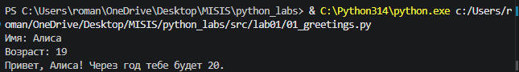
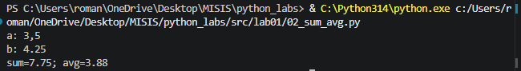
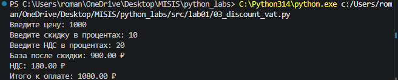
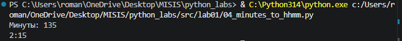
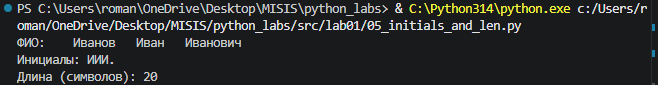
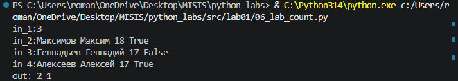
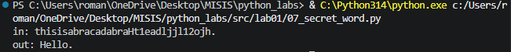

## ЛР1 — Ввод/вывод и форматирование

Ввод данных с клавиатуры, преобразование типов, форматированный вывод (f-строки), условия, циклы и работа со строками.

| № | Задание | Файл |
|---|---------|------|
| 1 | Приветствие | [`01_greetings.py`](01_greetings.py) |
| 2 | Сумма и среднее | [`02_sum_avg.py`](02_sum_avg.py) |
| 3 | Скидка и НДС | [`03_discount_vat.py`](03_discount_vat.py) |
| 4 | Минуты в формат ЧЧ:ММ | [`04_minutes_to_hhmm.py`](04_minutes_to_hhmm.py) |
| 5 | Инициалы и длина ФИО | [`05_initials_and_len.py`](05_initials_and_len.py) |
| 6 | Подсчёт очных и заочных | [`06_lab_count.py`](06_lab_count.py) |
| 7 | Секретное слово | [`07_secret_word.py`](07_secret_word.py) |

### Задание 1 — Приветствие

Файл: [`01_greetings.py`](01_greetings.py)

Программа запрашивает имя и возраст, выводит приветствие и сообщает, сколько лет исполнится через год.

*Рис. 1. Результат выполнения скрипта `01_greetings.py`.*

### Задание 2 — Сумма и среднее

Файл: [`02_sum_avg.py`](02_sum_avg.py)

Программа считывает два числа (допускается запятая в качестве десятичного разделителя) и выводит их сумму и среднее арифметическое с точностью до двух знаков после запятой.

*Рис. 2. Результат выполнения скрипта `02_sum_avg.py`.*

### Задание 3 — Скидка и НДС

Файл: [`03_discount_vat.py`](03_discount_vat.py)

Программа принимает цену, скидку и НДС в процентах, затем выводит базу после скидки, сумму НДС и итоговую стоимость к оплате.

*Рис. 3. Результат выполнения скрипта `03_discount_vat.py`.*

### Задание 4 — Минуты в формат ЧЧ:ММ

Файл: [`04_minutes_to_hhmm.py`](04_minutes_to_hhmm.py)

Программа переводит количество минут в формат «часы:минуты», выделяя целые часы и остаток минут.

*Рис. 4. Результат выполнения скрипта `04_minutes_to_hhmm.py`.*

### Задание 5 — Инициалы и длина ФИО

Файл: [`05_initials_and_len.py`](05_initials_and_len.py)

Программа получает ФИО одной строкой, формирует инициалы и подсчитывает длину строки в символах (с учётом пробелов между словами).

*Рис. 5. Результат выполнения скрипта `05_initials_and_len.py`.*

### Задание 6 — Подсчёт очных и заочных

Файл: [`06_lab_count.py`](06_lab_count.py)

Программа считывает количество студентов, затем для каждого — строку вида «фамилия имя возраст форма_обучения» (`True` — очная форма, иначе — заочная). На выходе печатается количество очных и заочных студентов.

*Рис. 6. Результат выполнения скрипта `06_lab_count.py`.*

### Задание 7 — Секретное слово

Файл: [`07_secret_word.py`](07_secret_word.py)

Программа находит в строке заглавную латинскую букву, с которой начинается скрытое сообщение, определяет шаг по позиции первой цифры и собирает итоговое слово, выбирая символы с этим шагом.

*Рис. 7. Результат выполнения скрипта `07_secret_word.py`.*
