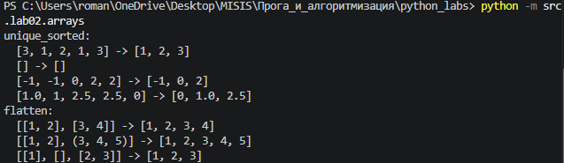
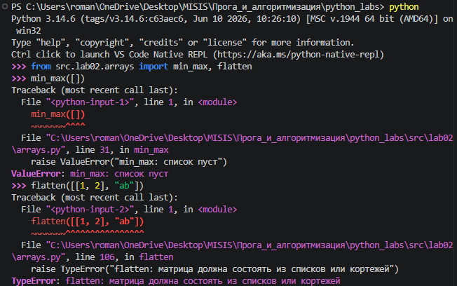
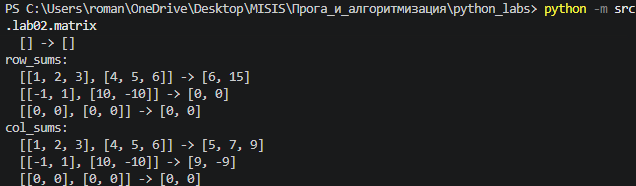
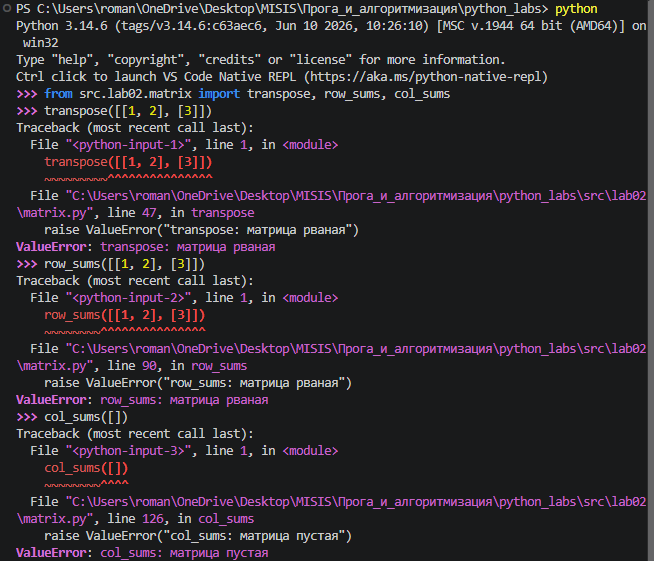
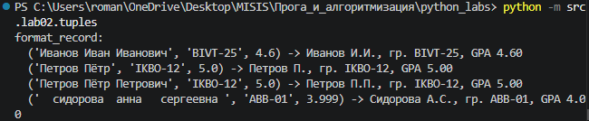
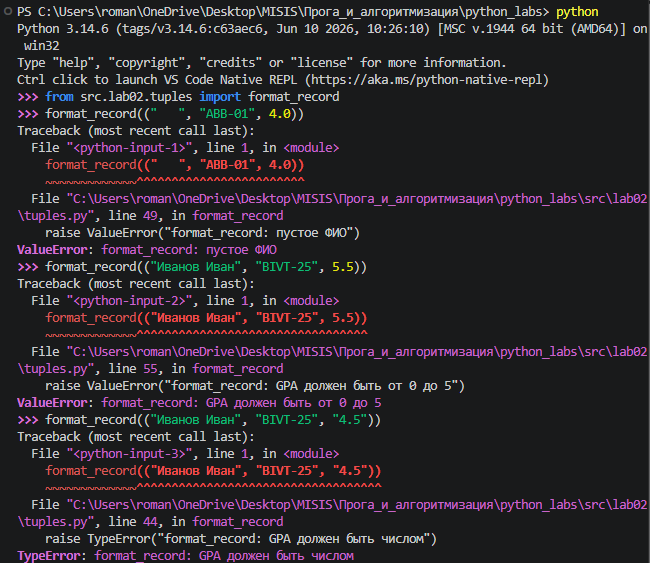

## ЛР2 — Коллекции и матрицы

Работа со списками, кортежами и множествами, обработка матриц (списков списков): транспонирование, суммы по строкам и столбцам, форматирование записей. Проверка входных данных с выбросом `ValueError` / `TypeError`.

| № | Задание | Файл | Функции |
|---|---------|------|---------|
| A | Массивы | [`arrays.py`](arrays.py) | `min_max`, `unique_sorted`, `flatten` |
| B | Матрицы | [`matrix.py`](matrix.py) | `is_jagged`, `transpose`, `row_sums`, `col_sums` |
| C | Кортежи | [`tuples.py`](tuples.py) | `format_record` |

### Запуск

Каждый файл запускается из корня репозитория и выводит результаты на тестах из задания:

```bash
python -m src.lab02.arrays
python -m src.lab02.matrix
python -m src.lab02.tuples
```

Примеры из docstring каждой функции можно проверить через doctest:

```bash
python -m doctest -v src/lab02/arrays.py
```

Встроенные `min()`, `max()`, `sorted()` и `.sort()` не используются. Входные данные функции не изменяют — результат всегда новый список.

---

### Задание A — `arrays.py`

#### `min_max(nums)`

Возвращает кортеж `(минимум, максимум)`. Оба значения начинаются с первого элемента списка, затем за один проход обновляются. Для пустого списка — `ValueError`.

```python
def min_max(nums: list[float | int]) -> tuple[float | int, float | int]:
    if len(nums) == 0:
        raise ValueError("min_max: список пуст")
    mn = nums[0]
    mx = nums[0]
    for x in nums:
        if x < mn:
            mn = x
        elif x > mx:
            mx = x
    return (mn, mx)
```

#### `unique_sorted(nums)`

Возвращает отсортированный по возрастанию список уникальных значений. Повторы убираются через `set()`, затем на каждом шаге из рабочего списка берётся минимум (через `min_max`), добавляется в результат и удаляется. Пустой список → `[]`.

```python
def unique_sorted(nums: list[float | int]) -> list[float | int]:
    result = []
    nums_s = list(set(nums))
    for _ in range(len(nums_s)):
        smallest = min_max(nums_s)[0]
        result.append(smallest)
        nums_s.remove(smallest)
    return result
```

#### `flatten(mat)`

«Расплющивает» список списков/кортежей в один список (построчно). Если элемент не список и не кортеж (например, строка) — `TypeError`.

```python
def flatten(mat: list[list | tuple]) -> list:
    result = []
    for row in mat:
        if isinstance(row, (list, tuple)):
            for x in row:
                result.append(x)
        else:
            raise TypeError("flatten: матрица должна состоять из списков или кортежей")
    return result
```



*Рис. 1. Результат выполнения `arrays.py` на тестах из задания.*



*Рис. 2. Обработка ошибок: `min_max([])` → `ValueError`, `flatten([[1, 2], "ab"])` → `TypeError`.*

---

### Задание B — `matrix.py`

#### `is_jagged(mat)` — вспомогательная

Проверяет, «рваная» ли матрица (строки разной длины). Используется в трёх функциях ниже. Пустая матрица рваной не считается.

```python
def is_jagged(mat: list[list[float | int]]) -> bool:
    if not mat:
        return False
    first_row_len = len(mat[0])
    for row in mat:
        if len(row) != first_row_len:
            return True
    return False
```

#### `transpose(mat)`

Меняет строки и столбцы местами: `t[j][i] = m[i][j]`. Внешний цикл — по столбцам, внутренний — по строкам; каждая новая строка создаётся заново. Пустая матрица → `[]`, рваная → `ValueError`.

```python
def transpose(mat: list[list[float | int]]) -> list[list]:
    if is_jagged(mat):
        raise ValueError("transpose: матрица рваная")
    if not mat:
        return []
    transposed = []
    for j in range(len(mat[0])):
        new_row = []
        for i in range(len(mat)):
            new_row.append(mat[i][j])
        transposed.append(new_row)
    return transposed
```

#### `row_sums(mat)`

Возвращает список сумм по каждой строке. Пустая или рваная матрица → `ValueError`.

```python
def row_sums(mat: list[list[float | int]]) -> list[float]:
    if not mat:
        raise ValueError("row_sums: матрица пустая")
    if is_jagged(mat):
        raise ValueError("row_sums: матрица рваная")
    sums = []
    for row in mat:
        sums.append(sum(row))
    return sums
```

#### `col_sums(mat)`

Возвращает список сумм по каждому столбцу. Столбца как отдельного списка нет, поэтому элементы собираются по индексам: внешний цикл по `j`, внутренний по `i`. Пустая или рваная матрица → `ValueError`.

```python
def col_sums(mat: list[list[float | int]]) -> list[float]:
    if not mat:
        raise ValueError("col_sums: матрица пустая")
    if is_jagged(mat):
        raise ValueError("col_sums: матрица рваная")
    sums = []
    for j in range(len(mat[0])):
        col_sum = 0
        for i in range(len(mat)):
            col_sum += mat[i][j]
        sums.append(col_sum)
    return sums
```



*Рис. 3. Результат выполнения `matrix.py` на тестах из задания.*



*Рис. 4. Обработка ошибок: рваная матрица в `transpose`, `row_sums`, `col_sums` → `ValueError`, пустая матрица в `col_sums` → `ValueError`.*

---

### Задание C — `tuples.py`

#### `format_record(rec)`

Принимает запись студента — кортеж `(ФИО, группа, GPA)` — и возвращает строку вида `Иванов И.И., гр. BIVT-25, GPA 4.60`. ФИО может состоять из 2 или 3 слов; лишние пробелы убираются, фамилия и инициалы приводятся к заглавным буквам, GPA выводится с двумя знаками после запятой.

Проверки: не тот тип записи или полей → `TypeError`; не 3 поля, пустое ФИО или группа, не 2–3 слова в ФИО, GPA вне диапазона 0–5 → `ValueError`.

```python
def format_record(rec: tuple[str, str, float]) -> str:
    if not isinstance(rec, tuple):
        raise TypeError("format_record: запись должна быть кортежем")
    if len(rec) != 3:
        raise ValueError("format_record: в записи должно быть 3 поля")

    fio, group, gpa = rec

    if not isinstance(fio, str) or not isinstance(group, str):
        raise TypeError("format_record: ФИО и группа должны быть строками")
    if isinstance(gpa, bool) or not isinstance(gpa, (int, float)):
        raise TypeError("format_record: GPA должен быть числом")

    parts = fio.split()
    group = group.strip()
    if not parts:
        raise ValueError("format_record: пустое ФИО")
    if len(parts) not in (2, 3):
        raise ValueError("format_record: в ФИО должно быть 2 или 3 слова")
    if not group:
        raise ValueError("format_record: пустая группа")
    if not 0 <= gpa <= 5:
        raise ValueError("format_record: GPA должен быть от 0 до 5")

    surname = parts[0].capitalize()
    initials = ""
    for name in parts[1:]:
        initials += name[0].upper() + "."

    return f"{surname} {initials}, гр. {group}, GPA {gpa:.2f}"
```



*Рис. 5. Результат выполнения `tuples.py` на тестах из задания.*



*Рис. 6. Обработка ошибок: пустое ФИО, GPA вне диапазона → `ValueError`, GPA строкой → `TypeError`.*
